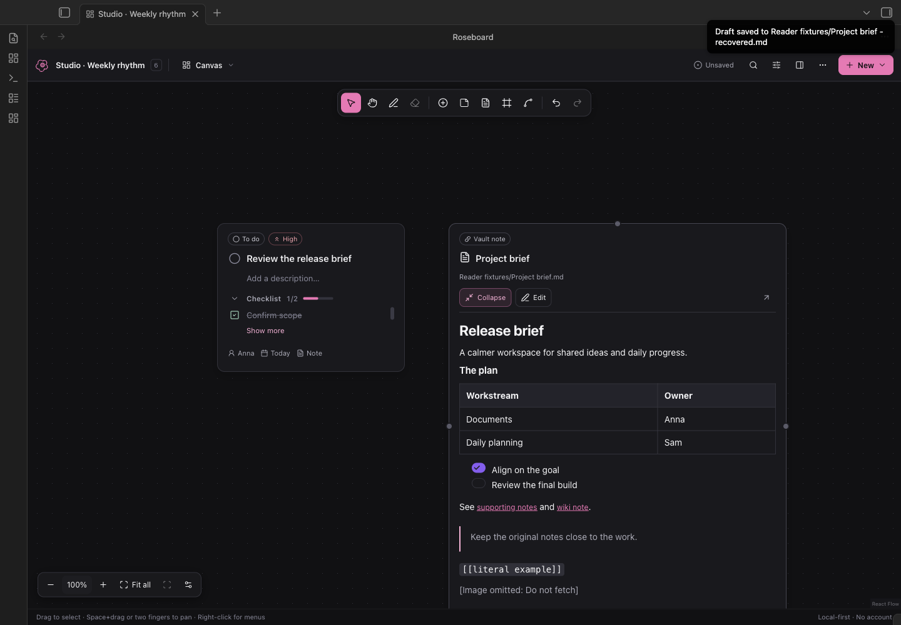

# Roseboard

A local-first visual task canvas for Obsidian. Charcoal surfaces, restrained rose accents, a full-pane working space, and plain Markdown as the source of truth.

**Version 1.5.2.** The plugin is installable on desktop and mobile (`isDesktopOnly: false`), uses no Node/Electron APIs at runtime, and bundles its assets. Actual device testing is documented in [the test report](docs/TEST-REPORT.md); mobile-capable does not mean Android-verified.



**[Download 1.5.2](https://github.com/ranKirito/obsidian-roseboard/releases/tag/1.5.2)** · **[Report a bug or suggest an improvement](https://github.com/ranKirito/obsidian-roseboard/issues/new/choose)**

Version 1.5.2 is the supported downloadable release. All development work is consolidated on `main`; older development remains in Git history. The [Obsidian Community Directory listing](https://community.obsidian.md/plugins/roseboard) is live: choose **Add to Obsidian**, then install and enable Roseboard. Manual installation is available below.

## What is new in 1.5.2

- **Cards keep your size.** Resize task cards smaller again. The description always shows and fills the room the card has. The checklist is a collapsible section that scrolls; **Show more** reveals up to ten steps without changing the card's saved size.

## What is new in 1.5.1

- **Write on the card.** Add and edit a task's description and checklist directly on its canvas card. Hover a card for the buttons, press Enter to keep adding steps, and double-click to edit. The completion circle now lines up with the task title in every view.

## What is new in 1.5

- **Checklists on cards.** Task cards list their checklist steps with checkboxes you can tick on the canvas. Cards grow to fit their steps; the size you set stays the minimum.
- **A new Day page with routines.** A week strip, a Tasks card for the day, and **Routines** kept separate from one-off tasks. Routines repeat on the weekdays you choose, tick off per day, and keep a streak. Drag tasks between the day, the Unscheduled tray and any day of the week.
- **Resize from any edge.** Hover a card's edge or corner and drag, no selection needed. The dots in the middle of each edge still start connections.
- **Tasks from anywhere land on the canvas.** Tasks added in Day, Calendar or Kanban get a card in the first free spot, without covering or moving other cards.
- **Roomier checklist editing** in the inspector, and a selection bar that stays clear of the zoom controls on narrow panes. See the [changelog](CHANGELOG.md).

## What is new in 1.4

- **A quieter workspace.** Switch views beside the board title. Search and filters open when needed. **New** adds tasks, sticky notes, documents and frames; **•••** holds Undo/Redo, Unplaced, Activity, source and export. The floating canvas palette keeps drawing and creation tools within reach. **Canvas options** beside zoom holds grid, minimap and input preferences.
- **Read on the canvas.** Click **Read** on a note card, or the note link on a task. The card widens and grows to fit the document (long notes scroll inside it). **Collapse** returns its original size. Reading does not move cards, save temporary sizes, or switch to another view.
- **Edit where you read.** Choose **Edit** on any document card, or double-click the document's content. The card grows as you type. Edit the full Markdown, including properties, then **Save note** or **⌘/Ctrl+Enter**. Cancel asks before discarding changes. Shared note drafts survive changing views; click Edit again to resume. The editor saves to the original note, separately from board undo.
- **Protected note saves.** If the original changes elsewhere, saving stops and keeps your draft. **Save a copy** creates a separate recovered note; Cancel discards only the draft and shows the current original. Notes open in source editors, notes containing Roseboard blocks, and notes over 100,000 characters are edited through Obsidian instead.

[Design research and UI decisions](docs/UI-RESEARCH.md) · [Verification](docs/TEST-REPORT.md)

## Also included from 1.3

- **Documents in the board.** Vault-note cards show live Markdown previews. The inspector previews a task's linked note too, and **Read on canvas** opens it on its card. (The separate Documents library view was removed in 1.5.) Tables, checklists and wiki links render, explicit relative Markdown links resolve from the document, and changes to the original refresh the preview. Use the card editor for Markdown changes, or **Open in Obsidian** for the full host editor.
- **Day.** Quick capture, completion progress, overdue work and an Unscheduled tray. Add tasks for a day, plan an undated task, or use its **Reschedule** menu for today, tomorrow, the selected day or no date. (Redesigned in 1.5, with routines; see above.) New daily tasks also get a canvas card in the first free spot near your existing work.
- **Calendar.** A Monday-first month view over the same task due dates. Select a day for its agenda, navigate months, or drag a task to another date. Scheduling keeps canvas positions and supports Undo.
- **Task ownership.** Assign tasks to a person or team in the inspector. Assignees appear on cards and task views, are included in search, and can be filtered with **Everyone / Unassigned / person**. They merge and remain reviewable like other task fields. Ownership is independent of the device name used for edit attribution.

Day and Calendar use the board's timezone and existing due dates. Filters apply to their tasks, counts and progress; **Clear active filters** is always visible while filtering. This is planning for the open board, without automatic recurrence or external calendar integration.

## What is new in 1.2

- **Freehand drawing.** Pick **Draw** (or press **P**), choose a colour and width, and sketch anywhere on the canvas with a mouse, trackpad, pen or finger. Ink is stored in the note alongside cards, moves and scales with the board, syncs and merges like every other record, and is undoable. **Erase** (**E**) removes the strokes a drag crosses; the canvas menu offers **Clear all ink…**. Scrolling and pinching still move the canvas while drawing; on touch screens switch to Hand to pan with a finger.

## What is new in 1.1

- **Working together over vault sync.** When another device (through Self-hosted LiveSync or any file sync) or an agent changes a board you have open, Roseboard now merges those changes into your board record by record instead of stopping with a whole-board conflict. Different cards and tasks combine silently; the same field changed on both sides resolves by recency and stays listed for review with *Keep* / *Use theirs*. Your undo history survives the merge. Cards the other side touched glow for a few seconds, and the **Activity** panel says who changed what. See [the storage specification](docs/STORAGE.md) for the exact rules.
- **Trackpad and mouse.** Two-finger scrolling pans and pinching zooms on a trackpad. A mouse wheel zooms towards the cursor, Shift+wheel pans sideways, middle-drag pans. Auto-detection watches the wheel deltas; **Canvas options** in the bottom-left cluster or the settings tab pins one behaviour. Space+drag pans in Select mode.
- **Faster editing.** Double-click empty canvas to add a task there; double-click a title, note or frame name to edit it in place; drag a connection from a card edge and drop it on empty space to create a linked task; right-click cards, connectors and the canvas for native menus; nudge selected cards with the arrow keys; align and distribute a selection; colour cards, notes and frames.
- **Kanban.** A third view over the same task records. Dragging a card between columns changes only its status; canvas positions are untouched. The List view can now be sorted.
- **Performance.** Unchanged cards keep their React Flow objects between renders; viewport culling switches on automatically for large boards; recovery drafts are written once per burst of edits instead of once per keystroke.

## Install 1.5.2

1. Download **[roseboard-1.5.2.zip](https://github.com/ranKirito/obsidian-roseboard/releases/download/1.5.2/roseboard-1.5.2.zip)**. Start with a test vault; back up your existing plugin folder before upgrading a vault you use daily.
2. Extract the ZIP and copy its `roseboard` folder into `<vault>/.obsidian/plugins/`. The folder should contain `main.js`, `manifest.json`, and `styles.css`, plus license files.
3. In the test vault, open **Settings → Community plugins**, enable community plugins, then enable **Roseboard**. Reload Obsidian if it was running while the files were copied.
4. Optionally download the [welcome board](examples/Welcome%20to%20Roseboard.md) and [sample note](examples/Project%20notes.md) into your test vault to explore the features.
5. Use **Roseboard: Open board** in the command palette, or switch the example note to Reading view and click **Open board**. **Roseboard: Create board** makes a new board note in `Boards/`.

The ZIP contains the production bundle, manifest, styles, license, and third-party notices. The complete editable source, lockfile, schema, tests, and examples are in this repository. No online build service, account, key, remote font, or backend is required.

Boards written by 1.0.0 open unchanged. The optional fields 1.1 adds (`color`, `updatedAt`, `updatedBy`), the optional `ink` record 1.2 adds, and optional `assignee` in 1.3 are ignored by older versions as unknown extensions and preserved on their round trips.

## Share feedback

Use the [bug report or feature request form](https://github.com/ranKirito/obsidian-roseboard/issues/new/choose). Include your Obsidian version, operating system, Roseboard version and the steps that reproduce the problem. Screenshots or a small example board help; remove private note text, paths and sync credentials before sharing. [Contributing guide](CONTRIBUTING.md).

## Working on a board

- **Canvas / Kanban / List / Day / Calendar:** all five task views operate on the same tasks. List and Kanban include tasks without cards. Search covers title, description, and tags. Today uses the board's calendar date; Overdue is a separate preset. Ready means unfinished with all prerequisites done.
- **Select / Hand / Draw / Erase:** Select drags a marquee (Shift adds to a selection; Space+drag pans). Hand pans empty space. Draw sketches ink strokes; Erase removes the strokes a drag crosses. Esc returns to Select. Zoom is 15–250 %; there is no finite coordinate boundary. Press **1** for 100 %, **⇧1** to fit everything, **⇧2** to fit the selection.
- **Task / Note / Vault note / Frame:** add a record or card at the view centre, or double-click empty canvas for a task. Select a card to edit in the collapsible inspector; on narrow panes it becomes a drawer. Frames group only cards assigned through **Frame membership**.
- **Connect:** drag from any edge of a card to another card. Drop on empty space to create a new task linked to the origin. The **Connect** bar chooses between ordinary relationships (solid, labelled) and prerequisite → dependent (dashed, updates `dependsOn` only) and offers a keyboard/touch alternative.
- **Context menus:** right-click a card for status, priority, colour, duplicate, align, remove and delete; right-click the canvas to create things at that point or toggle snapping and the minimap; right-click a connector to relabel or remove it.
- **Remove card:** removes placement, keeping the task in List, Kanban and Unplaced. **Delete task…** confirms removal of the record and incoming prerequisites; Undo restores it. Duplicate creates separate task/node/checklist IDs.
- **••• → Unplaced tasks → Place all:** creates a new grid below the current board without rearranging anything. **Jump** in List locates a card. **Focus** dims everything except a task and its immediate prerequisites/dependents.
- **Undo / Redo:** shared across views of this board, with one completed drag/resize/stroke per action and short typing groups coalesced. ⌘/Ctrl Z, ⇧Z, D (duplicate), A (select all) and Delete apply only when board controls, not text fields, have focus. V/H/P/E switch tools; there is deliberately no bare-letter shortcut that creates content by itself.

Commands: **Create board**, **Open board**, **New task in the active board**, **Open source**, **Validate board**, **Export JSON**. Export creates a new `.json` file in the configured boards/exports folder; it never overwrites a board. Markdown stays editable in normal Obsidian Source mode.

## Working together

Roseboard does not add a network service. Your existing vault sync delivers the other device's copy of the note; Roseboard then decides what to do with it.

- **Different records** (another card moved, another task edited, a task added or removed): combined automatically, saved, and shown in the Activity panel. Cards that changed glow briefly.
- **The same field on both sides** (you both renamed one task, or both moved one card): the more recently stamped edit wins when both sides carry stamps; otherwise your local value wins. Every such overlap appears in a bar above the canvas where you can keep the result or take the other value. Nothing is discarded silently.
- **Impossible combinations** (the merge would create a dependency cycle, or the new source is invalid): writes stop with **Conflict**, exactly as in 1.0.0. **Save local copy** and **Preserve draft & reload** remain available, and a later valid change from the other side is merged again automatically.
- **Attribution:** set a **Device name** in Roseboard settings (for example “Anna · Laptop”). Records you change carry `updatedBy`, so the other person sees who changed what, and overlaps resolve by recency. Stamps can be disabled; boards stay valid either way.
- **Line-level sync merges:** Roseboard writes task, card and connector records in a stable sorted order, so LiveSync's own text merge sees only the lines that really changed. A sync-layer merge that produces invalid JSON is still refused and reported, never autosaved over.

This is still not simultaneous conflict-free collaboration: there are no presence cursors and no server. A local save means the note on this device changed, not that another device has it.

## Source and recovery

A board lives inside exactly one `roseboard` fence in an ordinary Markdown note. Prose outside the block is preserved byte-for-byte, including CRLF line endings. The plugin rewrites the JSON payload in a readable two-space format after edits. See [the storage specification](docs/STORAGE.md), [JSON Schema](schema/roseboard-v1.schema.json), and [safe agent instructions](AGENTS.md).

Saves show **Unsaved → Saving → Saved locally**. Invalid/partial JSON retains the last valid display, disables writes, and offers source/export access; it is never replaced with an empty board. Opening source through Roseboard first finishes a save or preserves a draft. Any open Source/Live Preview editing view of the same note suspends canvas writes; close those editors or switch them to Reading view to revalidate and resume, at which point source edits are merged with pending canvas work.

Recovery files live in `<vault-config-dir>/plugins/roseboard/recovery/`. There is one `draft-<path-hash>.json` per unsaved source, written at most once every 0.8 s while edits are pending and cleared after successful saves, plus at most **10 recovery snapshots across this plugin installation**, taken for recovery copies or before discarding local edits during reload. On reopening a source, its draft is recovered and combined with any newer source changes; a draft that cannot be combined becomes a conflict.

Inline note drafts use separate `note-<path-hash>.json` recovery files, debounced by 0.4 s. They contain the full original baseline and edited Markdown, never board JSON. Reopening the card editor restores a pending draft; it must still pass the original-content check before saving. Drafts follow file/folder renames. A successful save or confirmed Cancel clears that note’s draft.

App backgrounding, view closing, and plugin unload attempt to flush/preserve pending edits. Force-quit or device failure can interrupt asynchronous writes; no completion guarantee is made. Recovery files are local plugin files and may not be included in your sync configuration.

## Boundaries

- Linked Markdown notes remain independent; cards have live previews and explicit Markdown editing. PDF, image and other attachment previews are not included in this release. Missing targets are labelled; open boards follow exact stored path/folder renames when writable. Links inside JSON are not promised to become native Obsidian backlinks.
- Markdown renders without raw HTML or images/embeds. Remote images never load automatically. Explicit HTTPS links can be opened by the user. References are limited to visible relative vault paths.
- The public note picker is provided. File-explorer drag payloads are not a documented public contract, so no private drag-and-drop integration is used. Kanban drag uses the platform drag-and-drop API; touch devices use the per-card **Move** menu instead.
- Session history holds up to 100 actions. It is rebased across merged remote changes and reset only by an explicit reload. It is not persisted across application restarts.
- Export JSON preserves the current validated local model, including unsaved recovery work; if no validated model exists it exports the raw fenced payload, which may be invalid or from an unsupported version.

## Develop and test

Node 22.12+, 24+, or 26+; npm with the included lockfile.

```sh
npm ci
npm test
npm run build
npm run dev       # optional watch build
npm run fixtures  # regenerate deterministic examples/stress fixture
npm run package   # rebuild and create installable release ZIP
```

Integration test setup on macOS with Obsidian installed:

```sh
node scripts/launch-test-vault.mjs
npm run test:obsidian
node scripts/reload-test-vault.mjs   # after a rebuild, refresh the running test instance
node scripts/test-planner-obsidian.mjs  # canvas document, planner and assignee acceptance checks
```

The launcher creates a temporary vault and separate profile and starts a separate Obsidian process with debugging bound to localhost port 19287. It writes only the temporary vault/profile and `.test-runtime/runtime.json`. It neither reads nor changes your normal Obsidian profile. The test driver reads that runtime file and refuses to target another vault. Close the test process after use; the generated test vault may be retained for inspection or deleted.

The test harness uses Playwright/CDP against actual Obsidian, not a browser imitation of Obsidian. See [test results and outstanding device checks](docs/TEST-REPORT.md).

## Deferred

Collapsible frames, templates, checkbox import, Markdown checklist export, and standard `.canvas` export remain deferred. Ink is stroke-only: no shapes, text tool, selection or moving of strokes, pressure-sensitive width, or export as an image yet. Gantt, recurring scheduling, AI chat, Tasks/Dataview bidirectional integrations, and multiplayer with presence remain outside scope. No placeholder buttons advertise these features.

## License and references

Roseboard is MIT licensed. Bundled libraries and their licenses are in `THIRD_PARTY_NOTICES.md`. React Flow's attribution remains visible. The [architecture and API notes](docs/ARCHITECTURE.md) record official sources, versions, and the mobile boundary.
